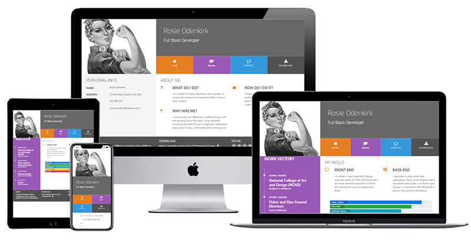

# Sample Resume
#### Mini project carried out through Code Institute during the User Centric Frontend Developement section.
---
[View the live project here](https://debbiepotts87.github.io/how-to-visit-the-netherlands/rotterdam.html)
 

---
# Technology Used

## Languages Used
[HTML5](https://en.wikipedia.org/wiki/HTML5)

[CSS3](https://en.wikipedia.org/wiki/CSS)

## Frameworks, Libraries & Programs Used
1. [Visual Studio Code](https://code.visualstudio.com/)
    * Visual Studio Code was used to complie the code to complete the website.
2. [Git](https://git-scm.com/)
    * Git was used for version control
3. [Github](https://github.com/)
    * Github is used to store the code
4. [Bootstrap 4.2.1](https://blog.getbootstrap.com/2018/12/21/bootstrap-4-2-1/)
    * Bootstrap was used to assist with the styling and responsivness of the site
5. [Font Awesome](https://fontawesome.com/icons)
    * Font Awesome was used to add styling to the site through icons
6. [Chrome Dev Tools](https://developer.chrome.com/docs/devtools/)
    * Chrome Dev Tools was used to debug minor issues and as an aid when styling the website
7. [Google Fonts](https://fonts.google.com/)
    * Used for the typography for a modern but easy to read design

    ---
# Testing
Testing was carried out throughout the project with the use of both [Google DevTools](https://developer.chrome.com/docs/devtools) and by watching live changes using [Visual Studio Code Live Server extension](https://marketplace.visualstudio.com/items?itemName=ms-vscode.live-server)

### W3C Validators
The W3C Markup Validator and the W3C CSS Validator were used to validate the code and ensure that there were no syntax errors in the project. No errors were found.

* [W3C Markup Validator](https://validator.w3.org/)
* [W3C CSS Validator](https://validator.w3.org/)

### Google Dev Tools
* Google Dev Tools was used to check responsive design

---
# Credits

## Code

* [Bootstrap 4.2.1](https://blog.getbootstrap.com/2018/12/21/bootstrap-4-2-1/)
    * Used throughout the project for grid layout and responsive design
* [Code Institute](https://codeinstitute.net/nl/)
    * Learning modules to create this site

## Content

* This was a mini project carried out via Code Institute learning modules. Videos were provided to support during this project.

## Media

* Images and resume provided by [Code Institute](https://codeinstitute.net/nl/)

## Acknowledgements
* [Code Institute](https://codeinstitute.net/nl/) for their learning module to create this website
